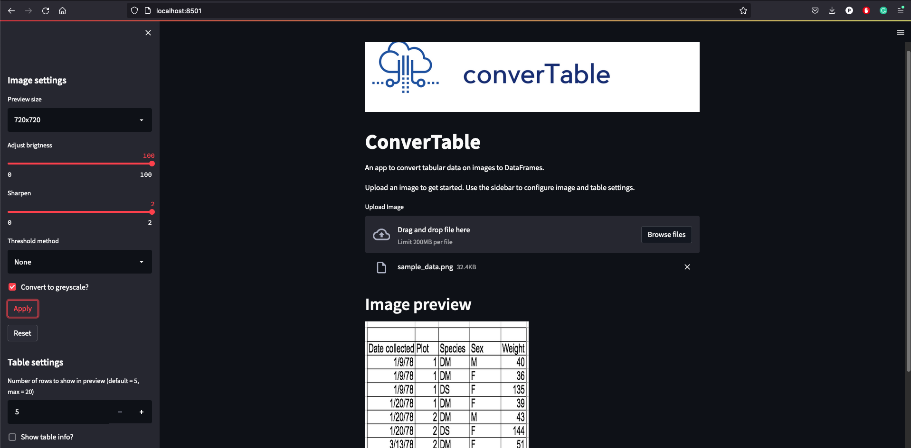

  
 

**converTable** is a python webapp hosted on `streamlit` to convert tabular data on images into a structured data tables.

The project seeks to help digitize record keeping in the Gambia. Most information in hospitals and offices (both government and private) is not stored digitally. The aim is to enable entities to have digital copies of data that will create ease of access for Data Scientists and Data practitioners.

It is currently developed and maintained by [Gibril](https://gibrilgaye.super.site) and [Modou Lamin](https://www.linkedin.com/in/modou-lamin-m-803212128/)

# To run locally
1. Clone this repo
2. Create a new conda environment and install requirements using `pip install -r requirements-dev.txt`.
3. Run `streamlit run convertable/converTable_app.py` in your terminal

Once we have a stable version, you will be able to run a no code version hosted in the cloud.

## Dependencies
converTable requires:
- Python (>= 3.7)
- Pandas
- streamlit
- OpenCV

## Streamlit App
---
 

___

# Contributing
Contributions are very welcome. To learn how to contribute, please see our [Contribution guide](CONTRIBUTING.md).

## Testing

